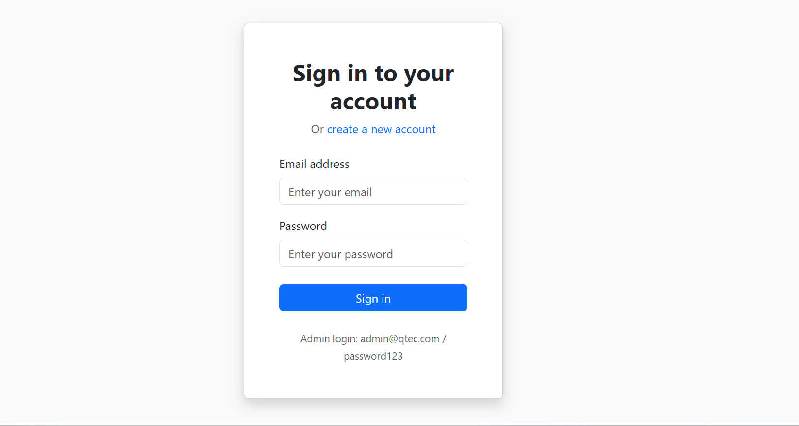
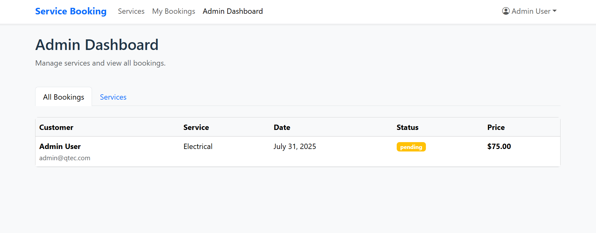
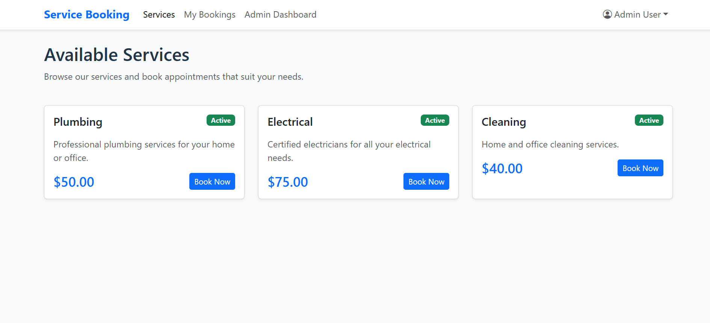
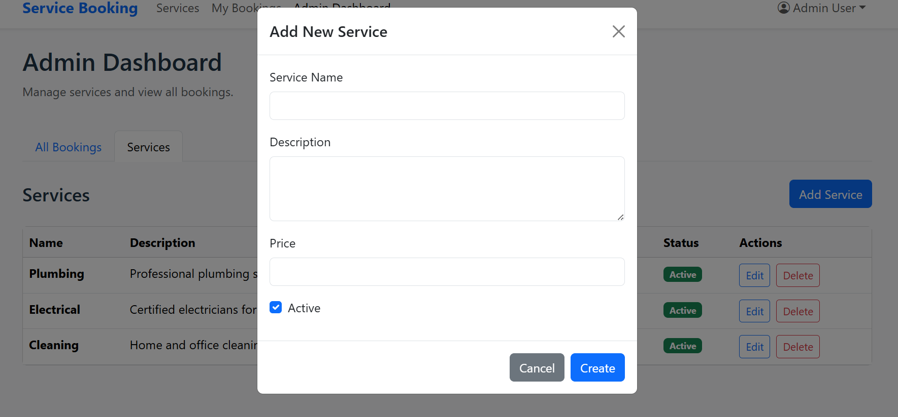
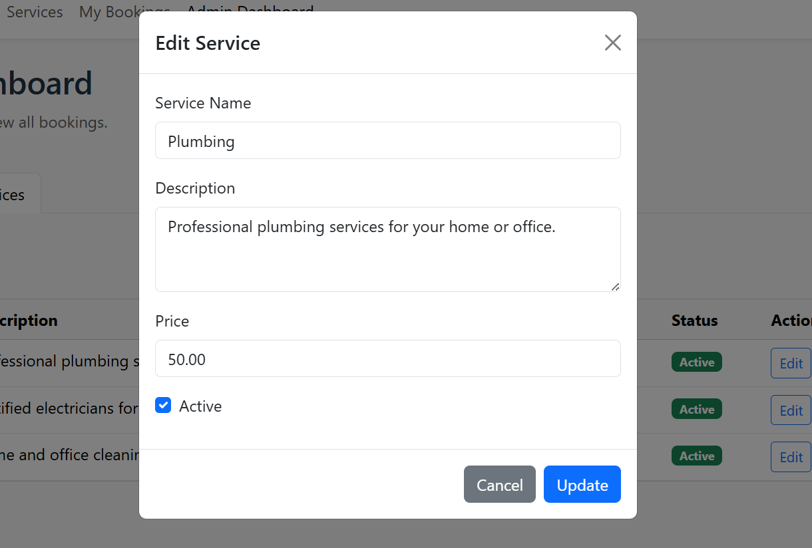

# Service Booking App

Hey there! 👋 This is my service booking application that I built for my portfolio. It's a full-stack app with Laravel 12 backend and React frontend.

## 🚀 What I Built

This is a complete service booking system where customers can book various services (like plumbing, electrical, cleaning) and admins can manage everything. I focused on building a clean, secure, and user-friendly application.

## 📸 Screenshots

### 🔐 Authentication Pages

*Clean and modern login interface with form validation*


*User registration with password confirmation*

### 🏠 Main Application

*Available services with booking functionality*


*User's booking history and management*

### 👨‍💼 Admin Panel

*Admin overview of all bookings and services*


*Admin can create, edit, and delete services*


*Admin editing service details with form validation*

### 📱 Responsive Design

*Fully responsive design works on all devices*

## 🛠️ Tech Stack

### Backend
- **Laravel 12** - PHP framework for robust API development
- **MySQL** - Database management
- **Laravel Sanctum** - API authentication
- **Eloquent ORM** - Database operations

### Frontend
- **React 18** - Modern JavaScript library for UI
- **Vite** - Fast build tool and development server
- **Tailwind CSS** - Utility-first CSS framework
- **Axios** - HTTP client for API communication

## 📁 Project Structure

```
service_booking_app/
├── backend/                 # Laravel 12 API
│   ├── app/
│   ├── config/
│   ├── database/
│   ├── routes/
│   └── ...
├── frontend/               # React + Vite application
│   ├── src/
│   ├── public/
│   └── ...
└── README.md
```

## 🚀 Getting Started

### Prerequisites
- PHP 8.2+
- Composer
- Node.js 18+
- MySQL 8.0+
- Git

### Backend Setup

1. Navigate to the backend directory:
   ```bash
   cd backend
   ```

2. Install PHP dependencies:
   ```bash
   composer install
   ```

3. Copy environment file:
   ```bash
   cp .env.example .env
   ```

4. Generate application key:
   ```bash
   php artisan key:generate
   ```

5. Configure database in `.env` file:
   ```env
   DB_CONNECTION=mysql
   DB_HOST=127.0.0.1
   DB_PORT=3306
   DB_DATABASE=service_booking_db
   DB_USERNAME=root
   DB_PASSWORD=
   ```

6. Run migrations:
   ```bash
   php artisan migrate
   ```

7. Start the Laravel development server:
   ```bash
   php artisan serve
   ```

### Frontend Setup

1. Navigate to the frontend directory:
   ```bash
   cd frontend
   ```

2. Install Node.js dependencies:
   ```bash
   npm install
   ```

3. Start the development server:
   ```bash
   npm run dev
   ```

## 📋 Features (Planned)

- [ ] User authentication and authorization
- [ ] Service listing and search
- [ ] Booking management
- [ ] Payment integration
- [ ] Admin dashboard
- [ ] Real-time notifications
- [ ] Review and rating system
- [ ] Service provider management

## 🔧 Development Workflow

1. **Backend Development**: API endpoints, database models, and business logic
2. **Frontend Development**: User interface, state management, and API integration
3. **Testing**: Unit tests, integration tests, and end-to-end testing
4. **Deployment**: Production-ready deployment configuration

## 📝 API Documentation

The API documentation will be available at `/api/documentation` when the backend is running.

## 🤝 Contributing

1. Fork the repository
2. Create a feature branch (`git checkout -b feature/amazing-feature`)
3. Commit your changes (`git commit -m 'Add some amazing feature'`)
4. Push to the branch (`git push origin feature/amazing-feature`)
5. Open a Pull Request

## 📄 License

This project is licensed under the MIT License - see the [LICENSE](LICENSE) file for details.

## 👨‍💻 About Me

Hi! I'm **Masud Rana**, a passionate developer who loves building practical applications. I created this service booking app to showcase my skills in:

- **Backend Development** with Laravel
- **API Design** and RESTful architecture
- **Database Design** with proper relationships
- **Authentication & Security** with Laravel Sanctum
- **Frontend Development** with React
- **Testing & Documentation**

## 📞 Get in Touch

Feel free to reach out if you have any questions about this project or want to discuss potential opportunities!

- **GitHub**: [@masud29](https://github.com/masud29)
- **Email**: masudrana06013@gmail.com
- **Phone**: 01737191929

---

**Note**: This project is part of my portfolio and demonstrates my full-stack development capabilities. I'm always learning and improving! 🚀